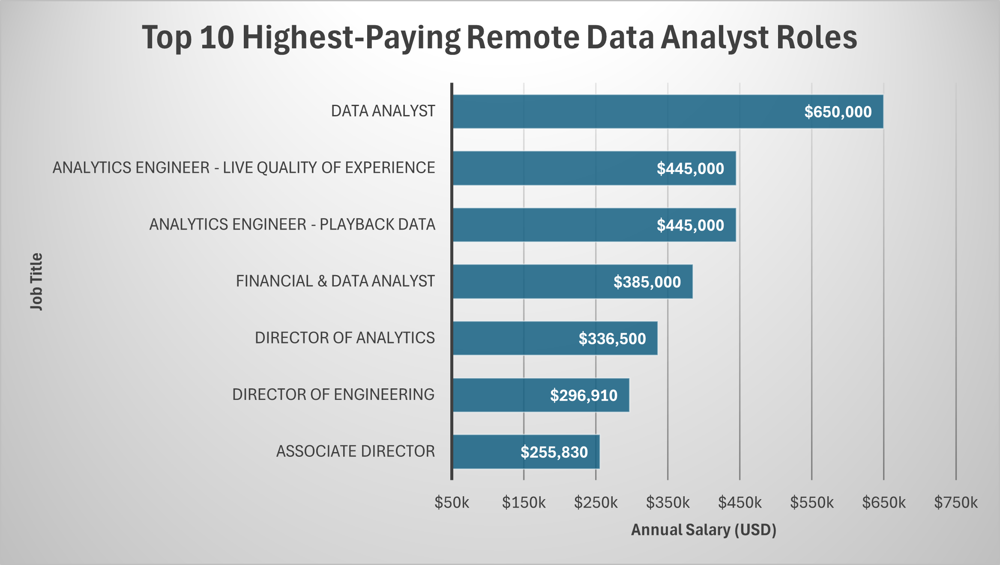
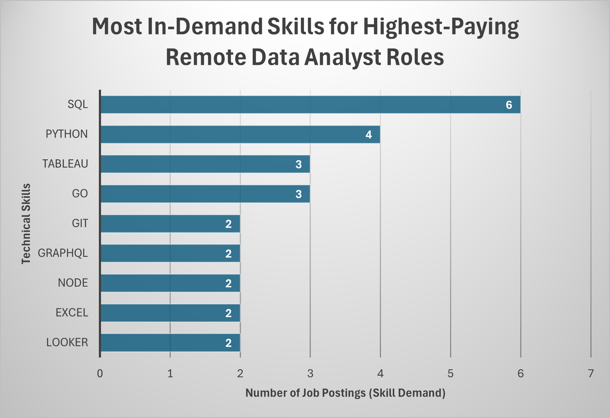
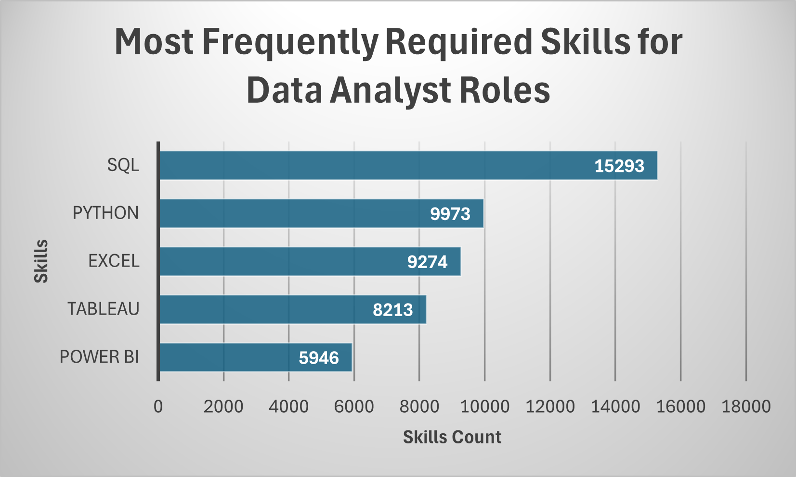

# Global Remote Data Analyst Salary & Skills Analysis (SQL)

## Project Overview
This project analyzes remote Data Analyst job postings to identify:
- The highest-paying remote roles
- The most in-demand technical skills
- Skills associated with higher average salaries
- Skills that balance strong demand with strong compensation

The analysis is conducted entirely in SQL using a structured relational dataset. Query results are exported and visualized to support data-driven insights into the remote data analytics job market.

---

## Dataset Structure
The dataset follows a star-schema–like structure with fact and dimension tables.

Tables used:
- job_postings_fact: Job postings, salary data, job metadata
- company_dim: Company information
- skills_dim: Skill names and categories
- skills_job_dim: Bridge table linking jobs and skills

---

## Tools & Technologies
- PostgreSQL
- SQL (CTEs, JOINs, aggregation, filtering)
- CSV data ingestion
- Data visualization (exported query results)

---

## Database Setup
The database schema and data ingestion process includes:
- Table creation with primary and foreign keys
- Indexing on join-heavy columns
- Bulk CSV loading using COPY

See: query/setup.sql

---

## Analytical Questions & Results

### 1. Top 10 Highest-Paying Remote Data Analyst Roles
Identifies the highest-paying fully remote Data Analyst positions based on annual salary.



---

### 2. Skills Required for the Highest-Paying Roles
Analyzes which technical skills are required by the top-paying remote Data Analyst jobs.



---

### 3. Most Frequently Required Skills (Market Demand)
Identifies the most in-demand skills across all remote Data Analyst job postings.



---

### 4. Skills Associated with the Highest Average Salaries
Determines which skills are linked to higher average salaries.


---

### 5. Strategically Valuable Skills (Demand vs Salary)
Highlights skills that offer both strong job demand and high average salaries.


---

## Key Insights
- SQL is the most consistently required skill across remote Data Analyst roles
- Programming languages significantly increase earning potential
- Some niche skills offer high salaries but lower demand
- The strongest career positioning combines high-demand and high-paying skills

---

## Repository Structure
```
├── dataset/
│   ├── company_dim.csv
│   ├── job_postings_fact.csv
│   ├── skills_dim.csv
│   └── skills_job_dim.csv
│
├── query/
│   ├── setup.sql
│   └── queries.sql
│
├── export_query/
│   ├── q1.png
│   ├── q2.png
│   ├── q3.png
│   ├── q4.png
│   └── q5.csv
│
├── visual/
│   ├── q1.png
│   ├── q2.png
│   ├── q3.png
│   ├── q4.png
│   └── q5.png
│
└── README.md
```

---

## SQL Code Reference
All queries used in this analysis are fully documented and reproducible.

See: query/queries.sql

---

## Project Value
This project demonstrates:
- Practical SQL analytics skills
- Relational schema design
- Business-focused analytical thinking
- Clear documentation suitable for professional portfolios
